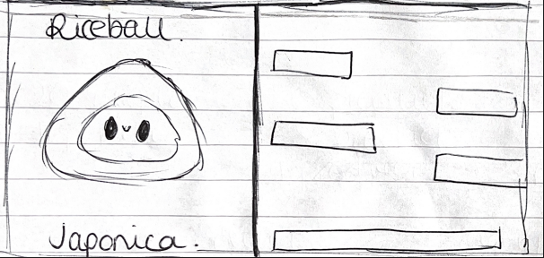
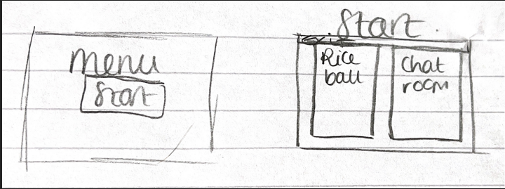
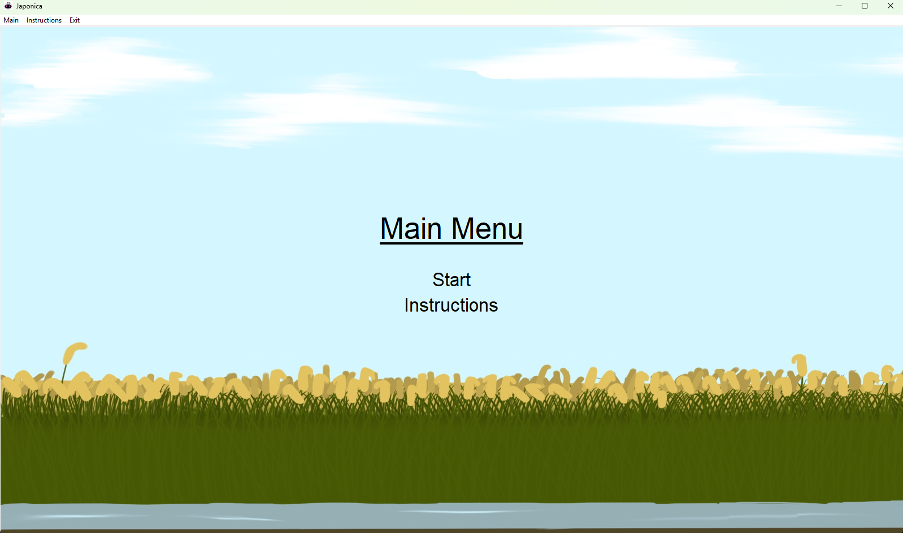
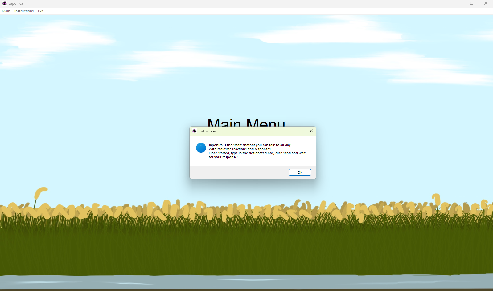
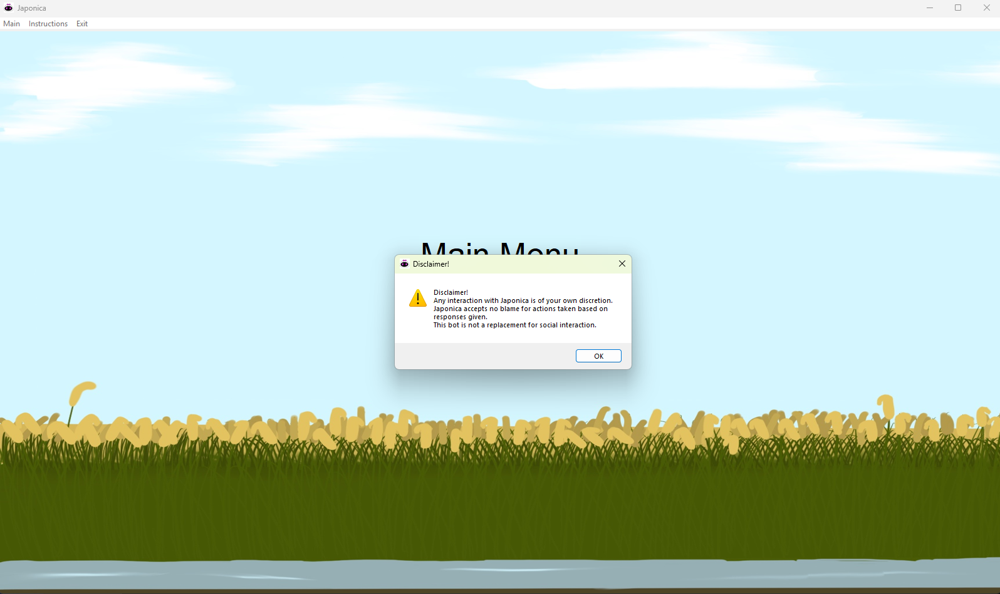
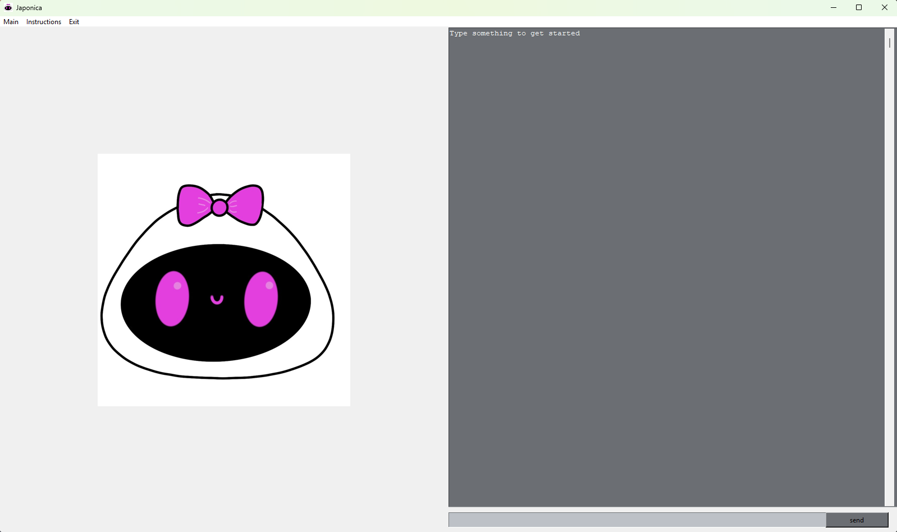
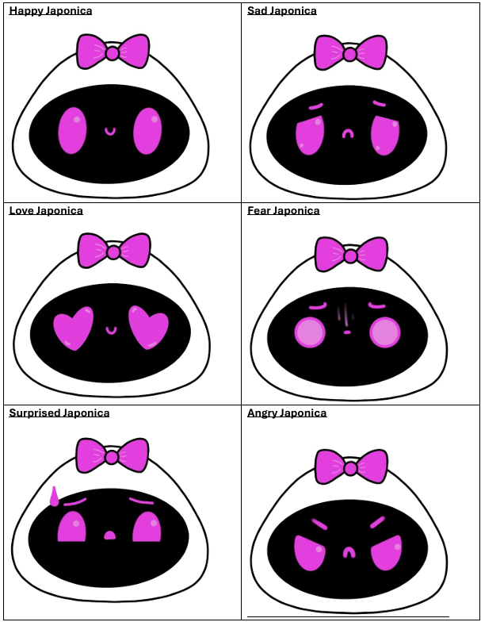
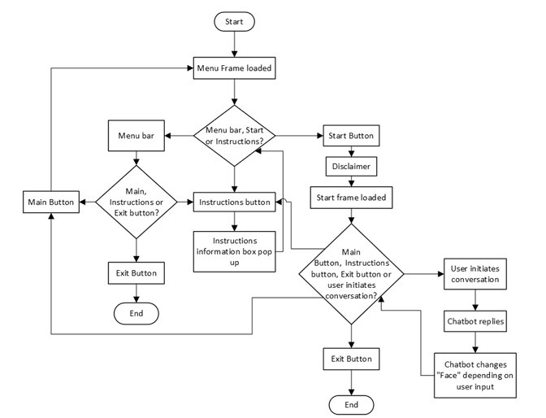
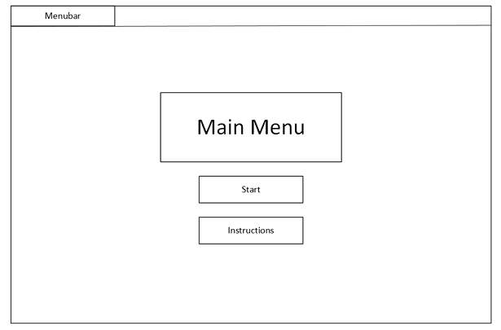
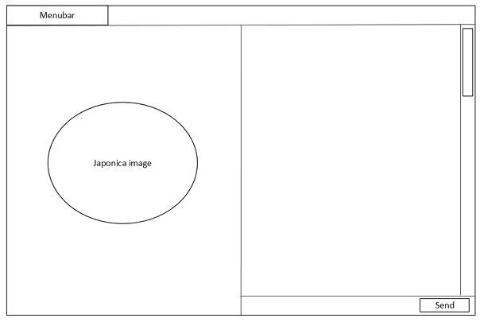

# University Dissertation Project: Robotic Design with Sentiment
Please note this work was submitted academically and will only be a summary of both report and product that was submitted.

## Aim
The aim is to develop a chatbot application that uses machine learning to classify emotions 
presented by the user and provide an appropriate response. This capability displays emotional 
intelligence which is essential for trust in Human-Robot interactions.

## Objectives
The key objectives of this project are as follows: 
1. Implement Chat Features 
2. Include “facial” expressions 
3. Initiate conversation with user and respond appropriately.

## Methodology
- Incremental Model
- Focuses on implementation and testing of individual features

## Core Requirements
**1.0 Root/Window** 
- 1.1 - Consists of 2 main frames: Start and Menu 
- 1.2 - Contains a menu bar 
- 1.3 – Menu bar consists of 2 options: Main and Exit 
- 1.4 – Contains the window title 
- 1.5 – Displays the dictated window size 
- 1.6 – Displays the “Japonica” icon bitmap
  
**2.0 Menu/Main** 
- 2.1 - Maintains menu bar stated in 1.2 
- 2.2- Contains main menu title 
- 2.3 - Contains a “Start” button that changes the menu frame to the start frame 
- 2.4 – Displays Main background

**3.0 Start** 
- 3.0.1 – Consists of 2 subsections: Rice ball and chatroom 
- 3.0.2 – Maintains menu bar stated in 1.2 

**3.1 Rice ball** 
- 3.1.1 - Displays “Sad” Japonica 
- 3.1.2 – Displays “Joy” Japonica 
- 3.1.3 – Displays ”Love” Japonica 
- 3.1.4 – Displays “Anger” Japonica 
- 3.1.5 – Displays “Fear” Japonica 
- 3.1.6 – Displays “Surprised” Japonica 

**3.2 Chatroom** 
- 3.2.1 – Displays “Japonica” responses 
- 3.2.2 – Displays user responses 
- 3.2.3 – “Japonica” and “User” headers are used to specify the name of each correspondent 
- 3.2.4 – Scroll bar implemented for chat view 
- 3.2.5 – User input box 
- 3.2.6 – User send button to transmit response to “Japonica” 

**4.0 Emotion Analysis** 
- 4.1 – Takes in user input 
- 4.2 – Processes dataset using dataset model 
- 4.3 – Provides an emotion prediction that influences the “Japonica” display in 3.1 

**5.0 General conversation** 
- 5.1 – Takes in user input 
- 5.2 – Processes dataset using dataset model 
- 5.3 – Provides a predicted appropriate response to the user’s input and is displayed by 3.2 

## Supplementary Requirements
These are requirements that were later identified that enhance the core requirements. 

**1.0 Root/Window** 
- 1.3 – Menu bar contains the additional “Instructions” tab 

**2.0 Menu/Main** 
- 2.4 – Contains an “Instruction” that prompts a message box containing how to use the 
application for the user. 

**3.2 Chatroom** 
- 3.2.1 – Return key can be used as an alternative to the send button 
- 3.2.2 - Prevents users from typing in the chat log 

## Initial Design

The initial idea was to have a facial reaction on one half of the application and a chat function 
on the other half.

Initial Design 1:

Initial Design 2:

## Final Design

### Main Menu

The main menu consists of a title dictating the page is the “Main Menu”, start and instruction 
buttons, and a menu bar with Main, Instructions and Exit.

---

### Instructions

When the Instructions button is clicked, a information box pops up explaining how the 
application works. The text reads ”Japonica is the smart chatbot you can talk to all day! With 
real-time reactions and responses. Once started, type in the designated box, click send and 
wait for your response!” 

---

### Disclaimer

When the Start button is clicked, a disclaimer appears before moving onto the Start Frame. The 
disclaimer states “Disclaimer! Any interaction with Japonica is of your own discretion. Japonica 
accepts no blame for actions taken based on responses given. This bot is not a replacement for 
social interaction.” 

---

### Start Interface

Once the user has exited the disclaimer, the application proceeds to the Start Interface. This 
consists of a “Rice ball” section which displays Japonica’s face and a “Chat room” section 
inclusive of a chat log that states “Type something to get started”, a scroll bar, a user input box 
and a send button.

---

## Japonica Facial Expressions

Below are the different designs representing the various facial expressions that Japonica can 
convey based on emotion recognition conducted. 

## Flow Diagram

## Wireframe Diagram

## Databases

## Technology Stack
- Python: Language
- Tkinter: Window creation
- Scikit-Learn: Process datasets
- Pillow: Transform images
- Torch: Mathematical operations
- Joblib: Save pretrained classifications

## Testing
- Black box: Functional testing
